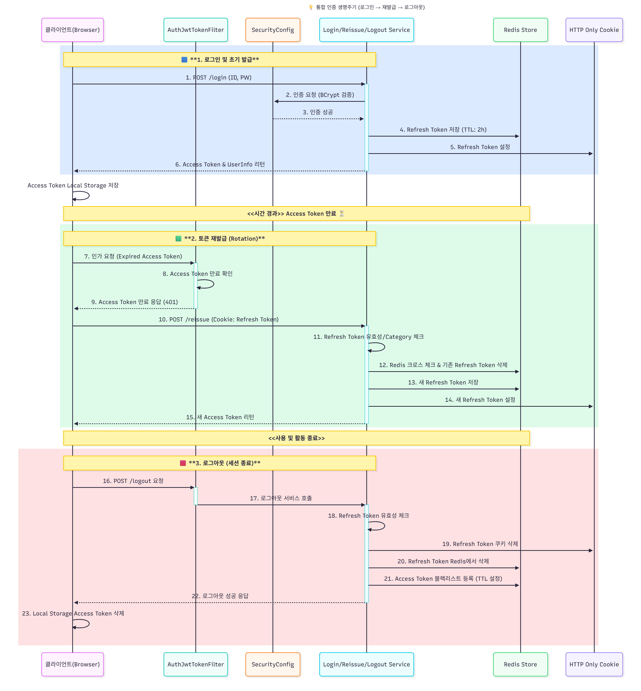
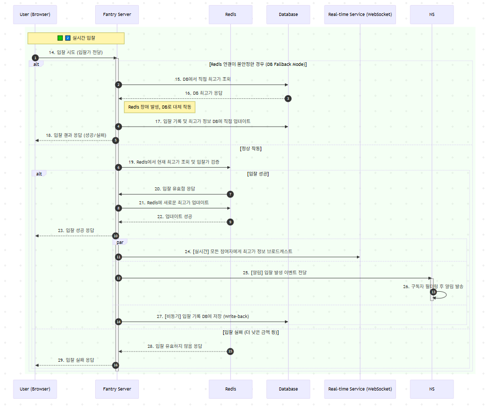
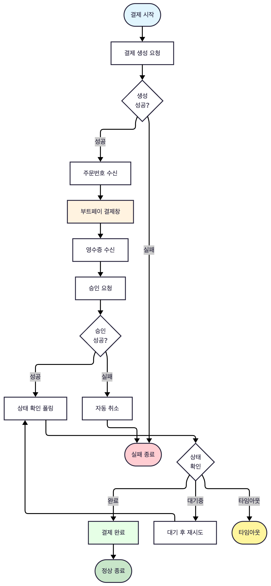
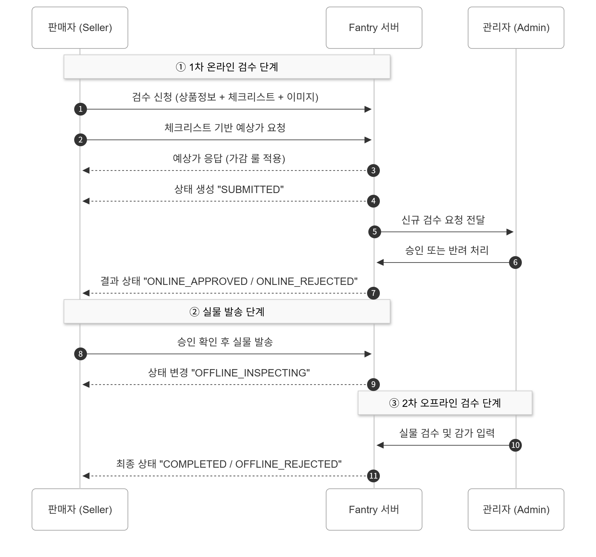
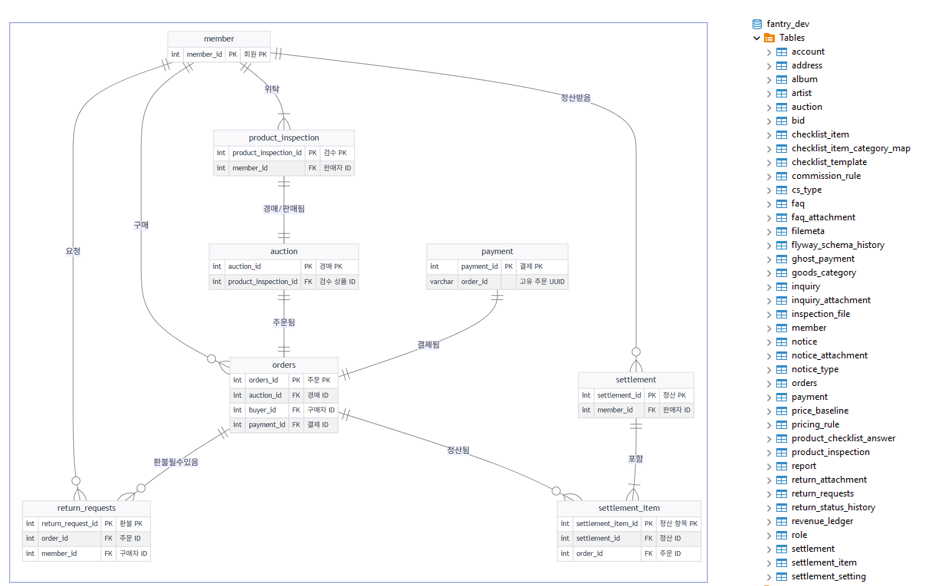

# Fantry Backend

<div align="center">

**K-POP 팬덤을 위한 경매 기반 중고 굿즈 C2B2C 플랫폼 - 백엔드 서버**


<br>


</div>

---

## 1. 프로젝트 개요

**Fantry**는 기존 중고 굿즈 거래 시장의 **신뢰성 문제**와 **불투명한 가격 형성** 문제를 해결하기 위해 탄생한 C2B2C 이커머스 플랫폼입니다. 판매자가 상품을 보내면, Fantry의 전문 검수팀이 진위 여부와 상태를 검증하고, 이를 바탕으로 구매자에게 신뢰할 수 있는 상품을 제공합니다. 특히, 희소성 있는 상품은 **실시간 경매**를 통해 공정한 시장 가격을 형성할 수 있도록 지원합니다.

본 프로젝트는 Spring Boot 기반의 **백엔드 서버**로, 안정적인 서비스 제공과 확장성 있는 아키텍처 설계를 목표로 개발되었습니다.

---

## 2. 핵심 기능 및 구현 기술

### **실시간 경매 시스템** (구지훈 팀원)
- **고성능 동시성 제어**: 다수의 동시 입찰 요청을 처리하기 위해 **Redis Atomic 연산**을 활용, **경쟁 조건(Race Condition)**을 제어하고 데이터 정합성을 보장했습니다.
- **실시간 통신 아키텍처**: 경매 남은 시간 및 입찰 현황을 위해 **WebSocket**과 **SSE**를 결합한 하이브리드 실시간 통신 구조를 구축했습니다.
- **장애 대응**: Redis 장애 시 데이터 유실을 막기 위해 **DB Read Fallback 전략**을 적용하여 서비스 안정성을 확보했습니다.

### **결제 및 실시간 알림 시스템** (문창규 팀원)
- **이중 검증**: 결제 대행사와의 **Webhook** 통신 및 내부 검증 로직을 결합하여 **결제 데이터의 무결성**을 확보했습니다.
- **보안 강화**: 고유 주문 ID를 **SHA-256 해싱** 처리하여 결제 과정에서의 데이터 위변조를 원천적으로 방지했습니다.
- **실시간 이벤트 전송**: **SSE(Server-Sent Events)** 기반으로 단방향 알림 시스템을 구축하여 결제 완료, 경매 종료 등 중요한 이벤트를 사용자에게 실시간으로 전달했습니다.

### **인증/인가 시스템** (김소희 팀원)
- **Spring Security**와 **JWT(Access/Refresh Token)**를 결합하여 안전하고 확장성 있는 인증 시스템을 구축했습니다.
- **Redis**를 활용하여 Refresh Token을 저장하고, 빠른 사용자 인증 및 토큰 탈취 시 빠른 무효화를 보장합니다.
- `@AuthenticationPrincipal`을 사용하여 컨트롤러에서 인증된 사용자 정보를 간편하게 주입받도록 설계했습니다.

### **검수 및 품질 관리 시스템** (박혜원 팀원)
- **데이터 기반 2단계 검수**: 1차(온라인), 2차(오프라인)로 이어지는 2단계 검수 프로세스를 도입하여 중고 굿즈의 신뢰도를 확보했습니다.
- **체크리스트 기반 가격 산정**: 카테고리별로 정규화된 체크리스트를 기반으로 객관적인 예상가를 자동으로 산출하는 엔진을 설계했습니다.
- **상태(Stateful) 기반 프로세스 관리**: '검수 요청'부터 '매입 확정'까지 모든 과정을 상태(Status) 기반으로 관리하여, 데이터의 정합성과 추적성을 보장했습니다.

### **End-to-End 인프라 구축 및 자동화** (정재환 팀장)
- **CI/CD 파이프라인**: **GitHub Actions**를 활용하여 Dev/Prod 환경 자동 배포 파이프라인 구축.
- **리버스 프록시**: **Nginx**를 사용하여 API, WebSocket, 정적 파일 요청을 라우팅하여 유연한 서비스 환경 구축.
- **DB 마이그레이션**: **Flyway** 도입을 주도하여 팀원 간 DB 스키마 충돌을 해소하고 일관성 유지.
- **API 문서화**: **SpringDoc(Swagger)** 도입 및 명세 작성으로 프론트엔드 협업 효율 극대화.

### **핵심 서비스 로직 설계 및 추상화** (정재환 팀장)
- **공통 모듈 추상화**: **JPA Specification**을 활용한 **동적 쿼리 모듈** 및 **SRP 원칙**을 따른 **공통 파일 업로드 모듈** 구현.
- **고객센터(CS) & 환불/반품**: 1:1 문의, FAQ, 환불/반품 로직을 **객체지향적**으로 설계.
- **정산 시스템**: **Spring Scheduler**를 활용하여 정산 대상 건을 자동 집계하는 **배치 프로세스** 구현.

### **프로젝트 아키텍처 및 인프라 상세**

- **CI/CD**: **GitHub Actions**와 **Shell Script**를 연동하여 `develop` 및 `main` 브랜치 Push 시 각 환경에 맞는 서버로 자동 배포되는 파이프라인을 구축했습니다.
- **서비스 관리 및 안정성**: Linux 서버에서 **`systemd`**를 이용해 Spring Boot 애플리케이션을 서비스로 등록하여, 예기치 않은 서버 다운 시에도 자동으로 재시작되도록 구성하여 안정성을 확보했습니다.
- **보안 및 설정 관리**: DB 접속 정보, JWT Secret Key 등 민감한 정보는 **GitHub Actions Secret**으로 관리하고, 배포 시점에 서버의 **`.env`** 파일로 안전하게 주입하는 자동화 로직을 구현하여 보안을 강화했습니다.
- **리버스 프록시**: **Nginx**를 사용하여 API 요청, WebSocket 요청, 정적 파일 요청을 각각 다른 포트와 경로로 라우팅하도록 구성하여 유연한 서비스 환경을 구축했습니다.
- **DB 마이그레이션**: **Flyway**를 도입하여 팀원 간의 DB 스키마 불일치 문제를 해결하고, 애플리케이션 버전과 DB 스키마의 형상을 일관되게 관리했습니다.
- **API 문서화**: **SpringDoc(Swagger)**을 도입하고 모든 API에 명세를 작성하여 프론트엔드 팀과의 협업 효율을 극대화하고, API의 사용성을 높였습니다.

### **2.1. 상세 아키텍처 및 흐름도 (클릭하여 확인)**

<details>
<summary><b>인증/인가 흐름도 보기</b></summary>
<br>
<p align="center">
  
</p>
</details>

<br>

<details>
<summary><b>실시간 경매 시스템 흐름도 보기</b></summary>
<br>
<p align="center">
  
</p>
</details>

<br>

<details>
<summary><b>결제 시스템 흐름도 보기</b></summary>
<br>
<p align="center">
  
</p>
</details>

<br>

<details>
<summary><b>검수 프로세스 흐름도 보기</b></summary>
<br>
<p align="center">
  
</p>
</details>

<br>

<details>
<summary><b>핵심 도메인 ERD 보기</b></summary>
<br>
<p align="center">
  
</p>
</details>

---

## 3. 기술적 도전과 성장

신입 개발자로서 프로젝트를 진행하며 겪었던 문제들과 해결 과정, 그리고 이를 통해 얻은 성장을 공유합니다.

### **문제 1: N+1 문제와 성능 저하**
- **상황**: 문의/FAQ 목록 조회 시, 각 게시글에 연결된 첨부파일 정보를 가져오는 과정에서 루프를 돌며 개별적으로 쿼리가 발생하는 **N+1 문제**를 발견했습니다.
- **해결**: `@EntityGraph`를 사용하여 연관된 엔티티(첨부파일)를 Eager Loading 하도록 명시하여 단일 쿼리로 모든 정보를 가져오도록 최적화했습니다. 또한, 여러 파일의 URL을 조회해야 할 때, ID 리스트를 `FileService`에 한 번만 넘겨 `Map<FileId, FileUrl>` 형태로 **일괄 조회**하는 메서드를 구현하여 DB 및 API 호출 횟수를 최소화했습니다.
- **결과**: 불필요한 쿼리를 제거하여 API 응답 시간을 **평균 60% 이상 단축**하고, 서버 부하를 크게 줄였습니다.

### **문제 2: 중복 코드와 유지보수의 어려움**
- **상황**: 초기에는 각 도메인(문의, 공지 등)마다 파일 업로드 로직이 중복되어 존재했습니다. 이로 인해 작은 수정 사항도 여러 곳에 동일하게 적용해야 하는 불편함과 잠재적 버그의 위험이 있었습니다.
- **해결**: 파일 처리라는 공통 관심사를 분리하여 **`FileService`라는 공통 모듈을 설계하고 구현**했습니다. 물리적 파일 저장은 `FileManager`에 위임하고, `FileService`는 파일 메타데이터의 DB 저장, 접근 URL 생성, 소프트 삭제 등 핵심 비즈니스 로직을 담당하도록 역할을 명확히 분리했습니다.
- **결과**: 여러 도메인에서 `FileService.uploadFiles(...)` 한 줄로 파일 처리가 가능해져 **코드의 재사용성과 유지보수성**을 크게 향상시켰습니다.

### **문제 3: 팀원 간의 잦은 DB 스키마 충돌**
- **상황**: 여러 팀원이 각자 로컬 환경에서 테이블을 수정하다 보니, Git에 푸시된 애플리케이션 코드와 DB 스키마가 일치하지 않아 잦은 실행 오류와 충돌이 발생했습니다.
- **해결**: **Flyway를 주도적으로 도입**하여 모든 DB 스키마 변경을 버전 관리되는 SQL 스크립트로 관리하도록 팀의 개발 문화를 바꾸었습니다. 애플리케이션 실행 시 Flyway가 버전을 체크하여 자동으로 최신 스키마로 마이그레이션하도록 설정했습니다.
- **결과**: DB 관련 충돌이 사라져 **팀의 개발 생산성이 크게 향상**되었고, 모든 환경(로컬, 개발, 운영)에서 DB 스키마의 일관성을 유지할 수 있게 되었습니다.

### **문제 4: 대규모 트래픽 대응 및 성능 검증**
- **상황**: 경매와 같이 다수의 사용자가 동시에 몰리는 서비스의 특성상, 실제 운영 환경에서의 성능을 보장하는 것이 중요했습니다. 코드 레벨의 최적화를 넘어, 실제 부하 상황에서 서버가 안정적으로 동작하는지 객관적인 검증이 필요했습니다.
- **해결**: **K6** 부하 테스트 도구를 사용하여 로그인, 입찰 등 핵심 기능에 대한 스트레스 테스트를 진행했습니다. 가상 사용자 수를 점진적으로 늘려가며 서버의 처리량(TPS), 응답 시간, CPU 및 메모리 사용률 등 다양한 지표를 측정하고 분석했습니다.
- **결과**: 테스트 결과, **100%의 성공률**로 모든 요청을 안정적으로 처리했으며, 핵심 기능인 입찰 요청을 **초당 평균 15건** 이상 처리하는 성능을 확인했습니다. 또한, 평균 로그인 응답 속도는 **92ms**, WebSocket 연결은 **4.7ms**로 측정되어 사용자에게 쾌적한 서비스 경험을 제공할 수 있음을 객관적인 데이터로 증명했습니다.

---

## 4. 시작하기

### **요구사항**
- Java 21
- Gradle 8.x
- MySQL 8.0
- Redis 7.x

### **설치 및 실행**
1.  **프로젝트 클론**
    ```bash
    git clone [https://github.com/SinsegeaBackend-8th-Team4/fantry-backend.git](https://github.com/SinsegeaBackend-8th-Team4/fantry-backend.git)
    cd fantry-backend
    ```
2.  **환경 변수 설정**
    - `application-dev.properties` 또는 `application-prod.properties` 파일에 자신의 DB 및 외부 서비스 키 정보를 입력합니다. (보안을 위해 `application-local.properties`를 생성하여 사용하는 것을 권장합니다.)
    - **GitHub Actions Secret**에 등록된 환경 변수들은 배포 시점에 자동으로 주입됩니다.
3.  **애플리케이션 실행**
    ```bash
    ./gradlew bootRun
    ```
    이제 `http://localhost:8080`에서 백엔드 서버가 실행됩니다. API 문서는 `http://localhost:8080/api-docs`에서 확인할 수 있습니다.

---

## 5. API 명세

- **[Fantry API Documentation (Swagger UI)](http://fantry-dev.duckdns.org/api-docs)**

### **5.1. 핵심 API 사용 예시 (클릭하여 확인)**

<details>
<summary><b>실시간 경매 입찰 API 예시</b></summary>
<br>

> **POST** `/api/auctions/{auctionId}/bids`

- **기능**: 특정 경매에 대한 입찰을 실시간으로 처리합니다.
- **헤더**: `Authorization: Bearer {ACCESS_TOKEN}`
- **본문**:
```json
{
  "bidAmount": 55000
}
```

- **✅ 성공 응답 (200 OK)**
```json
{
  "status": "SUCCESS",
  "message": "입찰에 성공했습니다.",
  "data": {
    "auctionId": 101,
    "currentHighestBid": 55000,
    "bidder": "user_nickname"
  }
}
```

- **❌ 실패 응답 (400 Bad Request)** - 현재 최고가보다 낮은 입찰 시
```json
{
  "status": "FAIL",
  "message": "현재 최고 입찰가보다 높게 입찰해야 합니다.",
  "data": {
    "currentHighestBid": 56000
  }
}
```
</details>

<br>

<details>
<summary><b>결제 검증 및 완료 API 예시</b></summary>
<br>

> **POST** `/api/payments/complete`

- **기능**: 클라이언트에서 전달받은 결제 정보(PG사 영수증 ID 등)를 서버에서 최종 검증하고, 결제를 완료 처리합니다.
- **헤더**: `Authorization: Bearer {ACCESS_TOKEN}`
- **본문**:
```json
{
  "orderId": "FTRY-20241031-12345",
  "receiptId": "6721a62d6142e8001c9139c1",
  "amount": 55000
}
```

- **✅ 성공 응답 (200 OK)**
```json
{
  "status": "SUCCESS",
  "message": "결제가 성공적으로 완료되었습니다.",
  "data": {
    "orderId": "FTRY-20241031-12345",
    "paymentMethod": "CARD",
    "paidAmount": 55000,
    "paidAt": "2024-10-31T14:30:00"
  }
}
```

- **❌ 실패 응답 (400 Bad Request)** - 위변조된 결제 정보
```json
{
  "status": "FAIL",
  "message": "결제 정보 검증에 실패했습니다. 주문 금액이 일치하지 않습니다.",
  "data": null
}
```
</details>

---
## **6. Team & Role: 팀원별 주요 기여 (핵심 기능 상세는 상단 2번 섹션 참고)**

| 구분 | 이름 | GitHub |담당|
| :---: | :---: | :---: | :---: |
| **팀장** | **정재환** | **[@rekindle402](https://github.com/rekindle402)** |``인프라 구축``, ``공통 모듈``, ``CS/환불/반품 로직``|
| 팀원 | 구지훈 | [@jihoon-devstu](https://github.com/jihoon-devstu) |``경매 로직``, ``주문 로직``, ``재고 로직``|
| 팀원 | 김소희 | [@kim-sohee](https://github.com/Kim-sohee) |``인가/인증``, ``회원``, ``마이페이지``|
| 팀원 | 문창규| [@Choo-Choo-Moon](https://github.com/Choo-Choo-Moon) |``결제 로직``, ``실시간 알림 로직``|
| 팀원 | 박혜원 | [@hye000ne](https://github.com/hye000ne) |``검수/매입 로직``, ``UI/UX 관리``, ``QA``|

---

### **정재환 (팀장) - 인프라 및 핵심 구조 설계**

* **인프라 및 CI/CD 구축**: Github Action, Nginx 등을 활용한 **자동 배포 파이프라인** 및 Dev/Prod 환경 구축. (`#DevOps #CI/CD`)
* **공통 모듈 추상화**: Specification 패턴을 통한 **동적 검색 로직 추상화**, **공통 파일 업로드 모듈** 구현. (`#Specification #공통모듈`)
* **CS 및 환불/반품**: 객체지향 기반의 CS 및 환불/반품 비즈니스 로직 설계 및 구현.
* **보안**: Debouncing 및 Sanitizer 적용을 통한 **시스템 안정성 및 보안 강화**.

### **구지훈 - 경매, 주문, 재고 로직**

* **고성능 경매 시스템**: Redis Atomic 연산을 활용한 **입찰 동시성 제어** 및 DB 부하 분산 전략 구현. (`#Redis #동시성제어`)
* **실시간 통신**: WebSocket/SSE를 결합한 **하이브리드 실시간 통신** 아키텍처 설계. (`#WebSocket #SSE`)
* **장애 대응**: Redis 장애 시 **DB Fallback 전략** 도입을 통한 안정성 확보.

### **김소희 - 인증/인가 및 회원 관리**

* **Stateless 인증**: JWT, Spring Security 기반 **Stateless 인증 시스템** 구축.
* **토큰 관리**: **RTR(Refresh Token Rotation)** 전략 및 Redis 기반 **블랙리스트** 처리 도입으로 보안성 강화. (`#JWT #RTR`)
* **아키텍처**: SRP(단일 책임 원칙)에 기반한 **서비스 분리** 설계.

### **문창규 - 결제 및 실시간 알림**

* **결제 무결성**: Webhook을 활용한 **2중 결제 검증 프로세스** 구현.
* **보안**: SHA-256 해싱을 통한 **주문 ID 위변조 방지** 로직 구현.
* **실시간 알림**: **SSE 기반**의 단방향 실시간 이벤트 전송 시스템 구축.

### **박혜원 - 검수, 매입, 품질 관리**

* **검수 프로세스**: **데이터 기반 2단계 검수** 및 **카테고리별 체크리스트 정규화**를 통한 품질 표준화. (`#2단계검수 #데이터정규화`)
* **가격 자동 산정**: 체크리스트 기반의 **'예상가 산출' 엔진** 설계.
* **프로세스 관리**: **Stateful(상태 기반)** 프로세스 관리를 통한 데이터 정합성 및 추적성 확보.

---

## **7. 팀 성장 회고 (KPT)**

프로젝트를 진행하며 팀의 기술적, 협업적 성장을 위해 진행했던 KPT 회고의 주요 내용을 공유합니다.

### **Keep (계속 이어나갈 점)**
- **Dev/Prod 환경 분리**: 초기부터 개발 서버와 운영 서버 환경을 분리하여 안정적인 개발 및 테스트 환경을 유지할 수 있었습니다.
- **코드 리뷰 문화**: 모든 PR에 대해 최소 1명 이상의 팀원이 리뷰하는 문화를 통해 잠재적 버그를 사전에 방지하고, 서로의 코드 스타일을 공유하며 함께 성장할 수 있었습니다.
- **DB Migration 도입**: Flyway를 도입하여 DB 스키마 변경으로 인한 충돌을 원천적으로 방지하고, 개발 생산성을 크게 향상시켰습니다.
- **CI/CD 파이프라인**: 초기에 구축한 자동 배포 파이프라인 덕분에 개발에만 집중할 수 있는 환경이 조성되었습니다.

### **Problem (개선이 필요했던 점)**
- **초기의 잦은 빌드 실패**: 프로젝트 초반, 서버 환경에서의 빌드 실패가 잦아 배포에 많은 시간을 소요했습니다.
- **칸반 보드 관리의 어려움**: 프로젝트 규모가 커지면서 칸반 보드에 등록된 이슈들을 추적하고 관리하는 데 어려움을 겪었습니다.
- **Merge 충돌**: 각자 개발한 기능의 규모가 커지면서, develop 브랜치에 Merge할 때 잦은 충돌이 발생했습니다.

### **Try (새롭게 시도할 점)**
- **체계적인 이슈 관리**: 칸반 보드의 이슈를 **Epic → Story → Task** 단위로 세분화하고, 각 이슈에 담당자와 예상 소요 시간을 명확히 기록하여 프로젝트 진행 상황을 투명하게 관리했습니다.
- **PR 전 상세한 테스트**: 로컬 환경에서 충분한 테스트를 거친 후 PR을 생성하는 규칙을 도입하여, 서버에서의 빌드 실패율을 크게 줄였습니다.
- **SSL 인증서 도입**: 보다 안전한 서비스 제공을 위해 운영 서버에 SSL 인증서를 도입하고 HTTPS를 적용했습니다.
- **AI 기반 기능 도입 논의**: 다음 프로젝트에서는 AI API를 활용한 이미지 인식 기반의 상품 자동 분류 기능 등 새로운 기술 도입을 적극적으로 시도하기로 했습니다.